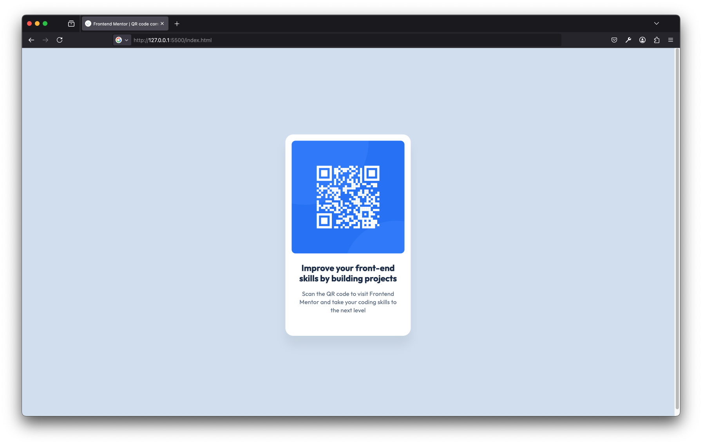

# Frontend Mentor - Blog preview card solution

This is a solution to the [Blog preview card challenge on Frontend Mentor](https://www.frontendmentor.io/challenges/blog-preview-card-ckPaj01IcS). Frontend Mentor challenges help you improve your coding skills by building realistic projects. 

## Table of contents

- [Overview](#overview)
  - [The challenge](#the-challenge)
  - [Screenshot](#screenshot)
  - [Links](#links)
- [My process](#my-process)
  - [Built with](#built-with)
  - [What I learned](#what-i-learned)
  - [Continued development](#continued-development)
- [Author](#author)

## Overview

### Screenshot

### Links

- [Live Site URL](https://larsb-dev.github.io/qr-code-component)
- [Solution URL](https://github.com/larsb-dev/qr-code-component)

## My process

### Built with

- Semantic HTML5 markup
- CSS custom properties
- BEM

### What I learned

I've rebuilt this project, because I deleted my previous solution. Because of that, I have not really learned anything new except that I've applied BEM notation after a long time.

### Continued development

Looking forward to some some more challenging projects.

## Author

- Frontend Mentor - [@larsb-dev](https://www.frontendmentor.io/profile/larsb-dev)